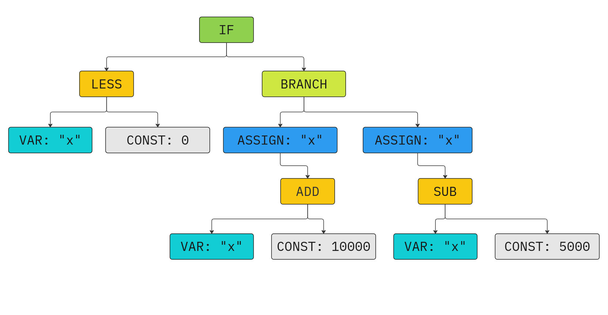

# TypoLang

C-like compiled programming language for people writing code with frequent typos.
TypoLang is not designed as actual usable programming language, so its syntax
is not comfortable to use. For example, `0` means closing parentheses and `8`
means multiplication operator. Because of this specifics, some numbers and
expressions must be written in a non-obvious way.

## Table Of Contents
- [TypoLang](#typolang)
  - [Table Of Contents](#table-of-contents)
  - [Compiler Usage](#compiler-usage)
  - [TypoLang User Guide](#typolang-user-guide)
    - [General Structure](#general-structure)
    - [Declarations](#declarations)
      - [Global Variables](#global-variables)
      - [Functions](#functions)
    - [Keywords](#keywords)
    - [Standard Library Functions](#standard-library-functions)
    - [Constants](#constants)
    - [Identifiers](#identifiers)
    - [Expressions](#expressions)
    - [Statements](#statements)
    - [Scopes](#scopes)
  - [Technical Details](#technical-details)
    - [General Information](#general-information)
    - [Input Tokenization](#input-tokenization)
    - [Token Parsing](#token-parsing)
    - [Middle-end Optimizations](#middle-end-optimizations)
    - [Backend Intermediate Representation](#backend-intermediate-representation)
    - [ELF Files](#elf-files)
    - [Performance Gain](#performance-gain)

## Compiler Usage

To use the TypoLang compiler (tlc) you need to:

1. Clone this repo from Github
    ```bash
    git clone https://github.com/MeerkatBoss/compiled-language
    cd compiled-language
    ```
2. Checkout to `binary_compiler` branch
    ```bash
    git checkout binary_compiler
    ```
3. Build `tlc` with GNU Make
    ```bash
    make all
    ```
4. Run `tlc` using GNU Make
    ```bash
    make run_frontend ARGS="<argument list>"
    make run_midend ARGS="<argument list>"
    make run_backend ARGS="<argument list>"
    ```

Information about command-line arguments of frontend, mid-end, and backend
compilers can be obtained by passing `"--help"` or  `"-h"` argument to them.

## TypoLang User Guide

### General Structure
Because TypoLang is a C-like language, program in TypoLang is a sequence of
*declarations*. User can declare global variables and functions. Each program in
TypoLang must declare `main` function, as it will be used as program entry
point by TypoLang compiler. The return value of `main` is used as program
exit code.

### Declarations

#### Global Variables

Global variable declaration starts with a keyword `var`, followed by variable
name.  After variable declaration, an *initializer* **must** follow. The
initializer is an [expression](#expressions), preceded by `:=` operator. Global
variable initialization **must** be terminated with `'` operator. Variable name
is valid to use in global scope only after its initialization. Variable cannot
appear in its own initializer expression. Examples of global variable
declarations are shown in Listing 1.

*Listing 1. Global variable declarations.*
```
var x := 21'
var y := 32 - x'
```

#### Functions
Function declaration starts with a keyword `fu n`, followed by function name and
a list of function parameters separated by `,` operator. List of function
parameters **must** be enclosed between `(` and `0`. List of function parameters
can be empty. Parameters are defined with `var` keyword followed by parameter
name. Function declaration **must** be followed by function body: a
[block statement](#statements). Function body [scope](#scopes) is nested in function
parameter scope. Function parameters are treated as if they were regular
variables. Syntax for function declaration is demonstrated in Listing 2.

*Listing 2. Function declarations.*
```
fu n foo(0
[
    riturn 10'
}

fu n bar(var x, var y 0
[
    riturn x + y - foo(0'
}
```

### Keywords

The following keywords are reserved and cannot be used as function or variable
names:

- `fu n`    - function declaration
- `var`     - variable declaration
- `eef`     - conditional statement 
- `els`     - conditional statement, false branch
- `vile`    - pre-condition loop
- `riturn`  - function return statement
- `or`      - boolean 'or' operator
- `aand`    - boolean 'and' operator
- `not`     - boolean 'not' operator
- `d`       - differentiation operator

### Standard Library Functions

TypoLang standard library provides the following functions:

- `read(0`      - read number from `stdin`. The number must be written with
                    exactly three digits after decimal point **WITHOUT** the
                    decimal point itself
- `print(var x 0`   - print number `x` to `stdout` in format described by `read(0`
- `sqrt(var x 0`    - calculate the square root of `x` and return it

No function defined in TypoLang program can have the same name as any of the
functions in standard library.

### Constants

Constants of TypoLang are fixed-precision decimal rational numbers. The decimal
separator is decimal point '`.`'. Decimal point can be omitted along with the
following digits. If the decimal point is not omitted, it must be followed by at
least one decimal digit. The integer part of the number can never be omitted.
Numbers 0.000 and 8.000 must always be written with decimal point or else they
will be interpreted as closing parentheses or multiplication operator
respectively. Examples of valid constants are presented in Listing 3.

*Listing 3. Valid constants.*
```
var x := 0.0'
var y := 2'
var z := 8.000'
var w := 4.125'
```

### Identifiers

Any sequence of characters [`a-zA-Z0-9_`] not starting with decimal digit is
interpreted as function or variable name. This means, that the closing
parentheses '`0`' and multiplication operator '`8`' must be separated from
their operands with a space, or else they will be interpreted as part of an
identifier. Examples of valid identifiers are shown in Listing 4.

*Listing 4. Valid identifiers.*
```
fu n function_1(0
[
    riturn 0.45'
}
var var1       := 42 - (6 / function_1 0'
var second_var := var2 8 function_1'
```

### Expressions

Expression is a sequence of operators, constants, and identifiers that
produce a value.

**TypoLang Operators**

- **Arithmetic:**
  - Addition: `+`
  - Subtraction: `-`
  - Multiplication: `8`
  - Division: `/`
  - Unary negation: `-`
- **Grouping:** `(` and `0`
- **Logic:**
    - `or`          - boolean 'or'
    - `aand`        - boolean 'and'
    - `not`         - boolean 'not'
- **Comparison:**
    - `<`           - less than
    - `.`           - greater than
    - `<=`          - less or equal
    - `>=`          - greater or equal
    - `====`        - equal
    - `1=`          - not equal
- **Function call:**
  - *function-name*`(`*arg1*`,` *arg2*`,` ... `0` - call function *function-name*
                                                    with argumets *arg1*, *arg2*, ...
- **Differentiation:**
  - `d(` *expression* `0 / d` *var-name* - transform *expression* containing
                                            only arithmetic operators, grouping
                                            parentheses, variables, and constants
                                            to its derivative (variable *var-name*
                                            is differentiation variable)

Multiplication by zero might be optimized to constant 0.000 by middle-end,
meaning that multiplication of function call result by zero is undefined
behavior if the called function produces any side-effects.

Logic operators operate only with numbers 0.001 (true value) and 0.000 (false
value). Application of logic operators to other numbers is undefined behavior.

Comparison operators compare their operands and produce logic value as a result
(0.000 or 0.001).

Table 1 demonstrates precedence of various TypoLang operators.

*Table 1. TypoLang operator precedence.*

| Operator                          | Precedence |
| --------------------------------- | ---------- |
| Grouping                          | 9          |
| Differentiation and function call | 8          |
| Unary `-`                         | 7          |
| `8` and `/`                       | 6          |
| `+` and `-`                       | 5          |
| Comparison                        | 4          |
| `not`                             | 3          |
| `aand`                            | 2          |
| `or`                              | 1          |

Listing 4 shows some examples of TypoLang expressions.

*Listing 4. TypoLang expressions. The last expression is transformed into
`1 8 y + x 8 0.000 + 1`.*
```
fu n foo(var x 0 
[
    riturn x + 1'
}

var x := ( 42 + 45 0 / 2'
var y := x + foo(x 0 8 x'
var z := d (x 8 y + 1 0 / d x
```

### Statements

Statement is a sequence of keywords and expressions which produce no value but
control the program execution.

**TypoLang Statements**

- **Variable initialization** - define new variable in current scope with given
                                value
  - `var` *var-name* `:=` *expression* `'`
- **Variable assignment**     - change the value of previously defined variable
  - *var-name* `<_` *expression* `'`
- **Function call**           - call function and discard its return value
  - *function-call-expression* `'`
- **Function return**         - stop function execution and return given value
  - `riturn` *expression* `'`
- **Conditional statement**   - select statement to execute based on condition
  ```
    eef ( <logic-expression> 0
      <statement>
    els
      <statement>
  ```
  The `els` branch may be omitted.
- **Loop statement**          - execute statement as long as condition is true
  ```
  vile ( <logic-expression> 0
    <statement>
  ```
- **Block statement**         - execute sequence of statements
  ```
  {
    <statements>
  ]
  ```

Various statements of TypoLang are presented in Listing 5.

*Listing 5. TypoLang statements.*
```
fu n main(0
[
    var x := 0.000'
    var y := 42'

    vile (x < 32 0
    [
        eef (y < 5 0
        [
            x <_ x + 2 8 y'
            y <_ y + 5'
        }
        els
        [
            x <_ x + y'
        }

        eef (y . 20 0
            y <_ y - 12'
        y <_ y - 3'
    }
    print (x 0'

    riturn 0.000'
}
```

### Scopes

Contexts, in which a given variable can be used are defined by the
*scope* in which it was declared. Variables can be used in expressions and
statements throughout the scope they were declared in, as well as in all its
nested scopes, unless shadowed by another local variable with the same name.
Whenever several variables with the same name exist in current context (current
scope and all its containing scopes), compiler assumes usage of a variable,
declared in the innermost scope.

*Global scope* contains all global variable names. Each block statement
defines its own nested scope. Function parameters have their
separate scope, nested in global and containing function body scope.

Function declarations cannot appear in scopes other than global. Their names
exist in their own context and can never be shadowed.

Listing 6 demonstrates examples of TypoLang scoped declarations.

*Listing 6. Scoped declarations*
```
var x := 42'

fu n main(0
[
    var y := x + read(0'
    var x := 32 + x'

    print (x 0'
    print (y 0'

    eef (y < 50 0
    [
        var y := y + x'
        x <_ y 8 3'

        print (x 0'
        print (y 0'
    }
    print (x 0'
    print (y 0'
}
```
```
INPUT:
5000
OUTPUT:
47000
74000

363000
121000

363000
47000
```

## Technical Details

### General Information

The TypoLang compiler is a combination of three distinct programs, called 
TypoLang frontend, middle-end, and backend compilers. The TypoLang frontend
compiler transforms the input file written in TypoLang into an Abstract Syntax
Tree (AST) and writes it in standard-compliant file format. TypoLang middle-end
compiler performs optimizations of produced syntax tree, collapsing constant
expressions and removing unnecessary operations (such as multiplication by 0 and
1, addition of 0 etc.). TypoLang backend compiler transforms the AST file into
an ELF executable file for x86-64 machines running Linux.

TypoLang compiler is compliant with [AST file standard](
https://github.com/MeerkatBoss/ast-standard/blob/master/README.md), developed
by a group of MIPT first-year students, including myself. The goal of this
standard was to create common format of intermediate files to allow
cross-compilation of standard-compliant languages.

Standard compliance allows interoperability of TypoLang backend and middle-end
with other standard-compliant frontend compilers. Additionally, AST file
produced by TypoLang frontend compiler can be optimized and compiled using other
standard-compliant middle-end and backend compilers, which allows for
cross-platform compilation.

### Input Tokenization

Before converting the input TypoLang file to Abstract Syntax Tree, the TypoLang
frontend compiler performs its *tokenization*, extracting TypoLang keywords and
operators, variable and function names, and constant values. Figure 1 shows
the result of tokenization of TypoLang code fragment.

|  |
| --- |
| *Figure 1. Code tokenization. Different tokens are denoted by different colors.* |

### Token Parsing

TypoLang frontend compiler passes the list of produced tokens to *parser*, which
converts it into AST using the recursive descent algorithm. The produced AST
is written into output file in a standard-compliant format. The AST for
previously tokenized code fragment is shown in Figure 2.

|  |
| --- |
| *Figure 2. Abstract Syntax Tree. Different node types are denoted by different colors.* |

### Middle-end Optimizations

TypoLang middle-end compiler reads the AST from file produced by frontend and
analyzes it, finding patterns which can be optimized. The optimized tree is then
written using the same format into an output file.

### Backend Intermediate Representation

Before producing x86-64 bytecode, TypoLang backend compiler converts the AST
into a linked list of entries. This list is called *Intermediate Representation
(IR)*. Usage of IR allows the backend compiler to efficiently calculate target
offsets of `JMP`, `Jcc` and `CALL` instructions. The IR also allows future
optimizations of bytecode based on analysis of nearby IR entries.

The IR entry is defined [here](src/data_structures/itermediate_repr/ir.h) as
follows:
```c
struct ir_node;
typedef ir_node* ir_node_ptr;
struct ir_node
{
    size_t          node_id;        // Node identifier (for debug purposes)
    bool            is_valid;       // Validity flag

    ir_op           operation;      // Operation type
    ir_operand      operand1,       // First operand of instruction
                    operand2;       // Second operand of instruction
    ir_cond_flags   flags;          // Condition flags for conditional commands
                                    // (CMOVcc and Jcc)
    ir_node_ptr     jump_target;    // Target of JMP, Jcc or CALL instruction
    size_t          addr;           // Instruction address

    size_t          encoded_length; // Length of instruction byte code
    unsigned char   bytes[16];      // Instruction byte code

    ir_node_ptr     next;           // Pointer to next node in linked list
};
```

The IR and disassembled binary code for previously built AST are presented in
Figures 3 and 4 respectively.

|  |  |
| --- | --- |
| *Figure 3. Intermediate Representation. IR nodes are denoted with the same color as AST node which produced them.* | *Figure 4. Binary code disassembly. Sections are denoted by the same color as IR node which produced them.* |

### ELF Files

ELF (Executable and Linking Format) requires:

1. *ELF file header*, containing general information about file:
```c
#define EI_NIDENT 16
typedef struct {
    unsigned char e_ident[EI_NIDENT];   // Magic constants and ABI version
    uint16_t      e_type;               // File type (ET_EXEC)
    uint16_t      e_machine;            // Machine info (EM_X86_64)
    uint32_t      e_version;            // ELF version (EV_CURRENT)
    Elf64_Addr    e_entry;              // Entry address (for executable files)
    Elf64_Off     e_phoff;              // File offset of first program header
    Elf64_Off     e_shoff;              // File offset of first section header
    uint32_t      e_flags;              // Processor-specific flags (undefined)
    uint16_t      e_ehsize;             // Size of ELF header
    uint16_t      e_phentsize;          // Size of program headers
    uint16_t      e_phnum;              // Number of program headers
    uint16_t      e_shentsize;          // Size of section headers
    uint16_t      e_shnum;              // Number of program headers
    uint16_t      e_shstrndx;           // Index of section, containing section
                                        // names (.strtab)
} Elf64_Ehdr;
```

2. One or more *program headers*, describing memory segments:
```c
typedef struct {
    uint32_t   p_type;      // Segment type
    uint32_t   p_flags;     // Segment flags (Read/Write/Execute)
    Elf64_Off  p_offset;    // Segment start file offset
    Elf64_Addr p_vaddr;     // Segment start virtual address
    Elf64_Addr p_paddr;     // Segment start physical address (equal to virtual
                            // on Linux)
    uint64_t   p_filesz;    // Size of segment in file
    uint64_t   p_memsz;     // Size of segment in memory
    uint64_t   p_align;     // Segment alignment (must be a multiple of page
                            // size)
} Elf64_Phdr;
```

3. Zero or more *section headers*, describing sections serving different
    purpose:
```c
typedef struct {
    uint32_t   sh_name;     // Index of section name in .strtab
    uint32_t   sh_type;     // Section type
    uint64_t   sh_flags;    // Section flags (Read, Alloc, Execute)
    Elf64_Addr sh_addr;     // Section address in memory
    Elf64_Off  sh_offset;   // Section start file offset
    uint64_t   sh_size;     // Size of section
    uint32_t   sh_link;     // Helper field
    uint32_t   sh_info;     // Helper field
    uint64_t   sh_addralign;// Alignment requirement
    uint64_t   sh_entsize;  // Size of entry (for sections containing entries
                            // of fixed size)
} Elf64_Shdr;
```

The ELF file produced by TypoLang backend compiler contains two segments of type
LOAD, which are loaded into memory before execution. The first segment can be
read and executed and contains binary code. The second one can be read from and
written to and contains space reserved for global variables.

Additionally, the produced file contains four sections. The first one is empty
and is required by ELF standard. The second one is the `.text` section,
containing executable code. This section is contained within the first LOAD
segment. Next is the `.bss` section, which occupies no actual space on disk, but
its memory image has the size enough to contain all global variables and is
filled with zeros upon loading. This section is contained within the second LOAD
segment. The last section is `.strtab` - string table which contains names of
all listed sections.

### Performance Gain

Change of compiler target platform can vastly improve performance written in
compiled language. The comparison of [this program](examples/test.tyl)
performance is shown in Table 2.

*Table 2. Test program performance comparison*
| Compiler version   | Execution time(ms) | Performance gain (times) |
| ------------------ | ------------------ | ------------------------ |
| MeerkatVM compiler | 540 $\pm$ 22       | 1                        |
| x86-64 compiler    | 23.8 $\pm$ 0.9     | 23 $\pm$ 1.4             |

Change of target platform for TypoLang compiler improved performance by the
factor of 20.  Additionally, the migration to x86-64 platform removed any
run-time dependencies of programs written in TypoLang, which makes them more
convenient for end user. 
